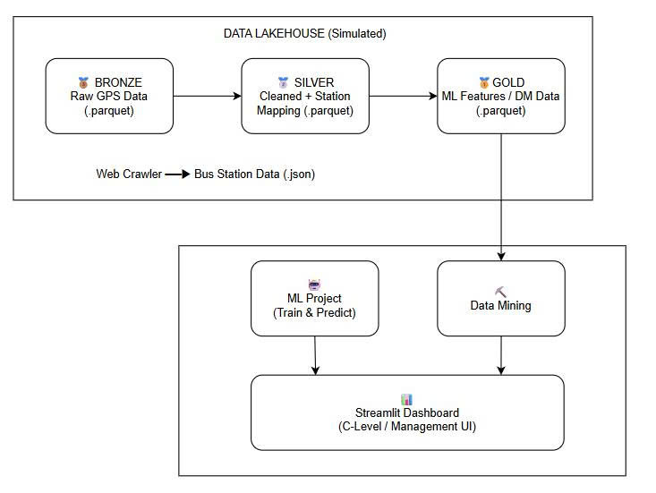

<p align="center">
  <h1 align="center">🚌 HCMC Bus Status Analysis & Prediction</h1>
  <p align="center">
    A Data Lakehouse prototype for analyzing Ho Chi Minh City's public bus GPS data using the <strong>Medallion Architecture</strong> (Bronze → Silver → Gold).
    <br/>
    <strong>Machine Learning</strong> predicts travel time between stations.
    <br/>
    <strong>Data Mining</strong> discovers hidden knowledge about traffic congestion and bus bunching.
  </p>
</p>

---

## 👥 The Team — Dreamlite

| Name | Student ID |
|------|-----------|
| Nguyễn Thành Phát | 2312593 |
| Trần Đỗ Đức Phát | 2312596 |
| Nguyễn Miên Phú | 2312658 |

**Instructor (ML):** Huỳnh Văn Thống — **Instructor (DM):** Đỗ Thanh Thái

**University:** Ho Chi Minh City University of Technology (HCMUT) — Vietnam National University

---

## 📋 Table of Contents

- [Overview](#overview)
- [Architecture](#architecture)
- [Dataset](#dataset)
- [Tech Stack](#tech-stack)
- [Project Structure](#project-structure)
- [Getting Started](#getting-started)
- [Pipeline Execution Guide](#pipeline-execution-guide)
- [Machine Learning — Travel Duration Prediction](#machine-learning--travel-duration-prediction)
- [Data Mining — Traffic Congestion & Bus Bunching Discovery](#data-mining--traffic-congestion--bus-bunching-discovery)
- [Streamlit Dashboard](#streamlit-dashboard)
- [Docker Deployment](#docker-deployment)
- [Testing](#testing)
- [Changelog](#changelog)
- [Current Status & Roadmap](#current-status--roadmap)
- [References](#references)

---

## Overview

This project processes **HCMC Bus GPS waypoint data** (~34 GB raw JSON, 31 bus routes, 50 days of continuous collection) through a simulated **Data Lakehouse** to achieve two distinct academic objectives:

### 🤖 Machine Learning (CO3117)
**Goal:** Predict the **travel duration (ETA)** between two consecutive bus stations using supervised regression models.

The problem is modeled as:

```
ETA_duration = f(start_station, end_station, distance, weekend, hour, route_avg_duration)
```

Three algorithms are trained and compared — Linear Regression (baseline), Random Forest (variance reduction), and Gradient Boosting (bias reduction) — with route-normalized evaluation to ensure fair comparison across short and long segments.

### ⛏️ Data Mining (CO3029)
**Goal:** Extract **hidden knowledge** from raw GPS traces to solve the "black box" problem in transit operations: automatically discovering traffic congestion hotspots, bus bunching/gapping patterns, and cascade domino effects.

Three data mining techniques are applied:
1. **FP-Growth** — Frequent itemset mining for route identification (data enrichment step)
2. **HDBSCAN** — Density-based spatial clustering for traffic black spot detection
3. **PrefixSpan** — Sequential pattern mining for congestion cascade discovery

> **⚠️ Prototype Status:** This is a working prototype processing **static/batch data** stored as Parquet files. The long-term goal is a real-time Data Lakehouse with Delta Lake.

---

## Architecture

The project follows the **Medallion Architecture** pattern:



### Data Flow

| Layer | Description | Storage |
|-------|------------|---------|
| **Bronze** | Raw GPS waypoints ingested from 356 JSON chunks. Stratified sampling with 8 time-bins. | `data/1_bronze/data_raw.parquet` |
| **Silver** | Cleaned data: deduplicated, geo-filtered (HCMC bounding box), enriched with nearest bus station via **BallTree** (Haversine). GPS points >1000m from any station are removed. | `data/2_silver/bus_gps_data.parquet` |
| **Gold (ML)** | Feature-engineered dataset for regression: trajectory compression → station-pair extraction → Haversine distance, cyclical hour encoding, weekend flag, historical route average duration (with fallback strategy). | `data/3_gold/ml_gold_data.parquet` |
| **Gold (DM)** | Enriched operational dataset: trip segmentation (1800s gap), FP-Growth route inference, HDBSCAN black spot clustering, bunching/gapping headway analysis. | `data/3_gold/dm_gold_data.parquet` |

---

## Dataset

**Source:** [HCMC Bus GPS Dataset](https://www.kaggle.com/datasets/e42c91f126e0df5b66879f9bfcf72d437411e34cf8557bbdbfc446616781ef9c) by Khang Nguyen Duy & Nam Thoai

| Property | Value |
|----------|-------|
| **Coverage** | 31 representative bus routes across HCMC |
| **Duration** | 50 continuous days (Mar 20 – May 10, 2025) |
| **Raw Size** | ~34 GB (356 JSON files) |
| **Records** | Tens of millions of GPS waypoints |

Each GPS record contains:
- `vehicle` — bus identifier
- `x`, `y` — longitude/latitude coordinates
- `datetime` — UNIX timestamp
- `speed` — instantaneous speed (km/h)
- `door_up`, `door_down` — passenger door states
- `sos`, `driver`, `heading`, `aircon`, `working`, `ignition` — hardware status fields

Supplementary data (bus station locations and route definitions) is crawled from the EBMS API (`apicms.ebms.vn`).

---

## Tech Stack

| Component | Technology |
|-----------|-----------|
| **Language** | Python 3.10+ |
| **Compute & Data** | Pandas, NumPy |
| **Storage Format** | Apache Parquet (PyArrow) |
| **Spatial Indexing** | scikit-learn BallTree (Haversine) |
| **Machine Learning** | scikit-learn (Linear Regression, Random Forest, Gradient Boosting) |
| **Data Mining** | mlxtend (FP-Growth), PrefixSpan, HDBSCAN |
| **Dashboard** | Streamlit, Plotly, Folium, Pydeck |
| **Web Crawling** | DrissionPage (Cloudflare bypass) |
| **Orchestration** | Dagster (Software-Defined Assets) |
| **Containerization** | Docker, Docker Compose |
| **Testing** | PyTest |
| **Configuration** | YAML (Single Source of Truth for all thresholds) |

---

## Project Structure

```text
Bus-Status-Analysis-Prediction/
│
├── app/                                  # 📊 Streamlit Dashboard
│   ├── Dashboard.py                      # Entry point — KPI overview, risk trends, driver profiling
│   ├── helpers.py                        # Shared helper functions
│   └── pages/
│       ├── 1_predict_duration.py         # ML travel-time prediction interface
│       ├── 2_Black_Spot.py               # HDBSCAN traffic black spot 3D map
│       └── 3_Transit_Performance.py      # Bunching/Gapping heatmaps + PrefixSpan domino viz
│
├── config/
│   └── business_rules.yaml              # ⚙️ SSOT: all spatial, temporal, speed, profiling thresholds
│
├── data/                                 # 🗄️ Simulated Data Lake
│   ├── bus_gps/                          # Raw GPS JSON chunks (sub_raw_*.json)
│   ├── 1_bronze/                         # Bronze layer (raw parquet + crawled station data)
│   ├── 2_silver/                         # Silver layer (cleaned + BallTree station-mapped)
│   ├── 3_gold/                           # Gold layer (ML features + DM inferred routes)
│   ├── bunching.parquet                  # Bunching/Gapping analysis results
│   ├── domino_rules.parquet              # Domino cascade rules
│   └── black_spot.parquet                # HDBSCAN traffic black spot clusters
│
├── docs/                                 # 📝 Technical Reports & Documentation
│   ├── ML_report.md                      # Full ML report (Vietnamese)
│   ├── DM_report.md                      # Full DM report (Vietnamese)
│   ├── architecture.md                   # System architecture documentation
│   └── ...                               # Pipeline docs, threshold analysis, etc.
│
├── models/                               # 🧠 Trained ML Models
│   ├── train_ml_model.py                 # Training script (3 algorithms + validation curves)
│   ├── randomforest_model.pkl            # Deployed model (chosen for stability)
│   ├── gradientboosting_model.pkl        # Best R² score
│   └── linear_regression_model.pkl       # Baseline
│
├── pipelines/                            # 🏗️ ETL & Mining Pipeline Scripts
│   ├── bronze_pipeline.py                # JSON → Bronze Parquet
│   ├── crawl_bus_station_pipeline.py     # EBMS API bus station web crawler
│   ├── silver_pipeline.py                # Bronze → Silver (cleaning + BallTree mapping)
│   ├── ml_gold_pipeline.py               # Silver → Gold ML (feature engineering for ETA)
│   ├── dm_gold_pipeline.py               # Silver → Gold DM (FP-Growth route inference + black spots)
│   ├── bunching_pipeline.py              # Gold DM → Bunching/Gapping + domino cascade analysis
│   └── prefix_span.py                    # Pre-computed PrefixSpan sequential pattern mining
│
├── orchestration/
│   └── assets.py                         # Dagster Software-Defined Assets DAG
│
├── tests/                                # ✅ Unit & Benchmark Tests
│   ├── test_gold_station_refactor.py     # Gold layer vectorization regression tests
│   ├── test_map_bus_consistency.py       # BallTree station mapping consistency
│   ├── test_route_inference.py           # IRF-weighted FP-Growth route inference tests
│   ├── test_routewise_error.py           # Route-normalized evaluation consistency
│   ├── test_prefixspan_benchmark.py      # PrefixSpan performance benchmarks
│   ├── test_silver_transform.py          # Silver transform unit tests
│   └── benchmark_route_inference.py      # Route inference accuracy benchmarks
│
├── Dockerfile                            # Python 3.10-slim + auto-pipeline entrypoint
├── docker-compose.yml                    # Single-service orchestration with volume mount
├── entrypoint.sh                         # Smart startup: check 13 assets → run missing stages → launch app
├── requirements.txt                      # Python dependencies
└── vehicle_route_mapping.csv             # Ground-truth vehicle ↔ route reference mapping
```

---

## Getting Started

### Prerequisites

- **Python 3.10+**
- **pip** (or **Docker** for containerized deployment)

### 1. Clone & Setup

```bash
# Clone the repository
git clone https://github.com/ZanissNguyen/Bus-Status-Analysis-Prediction.git
cd Bus-Status-Analysis-Prediction

# Create and activate virtual environment
python -m venv venv

# Windows
.\venv\Scripts\activate

# Linux/Mac
source venv/bin/activate

# Install dependencies
pip install -r requirements.txt
```

### 2. Data Setup

1. **Download the Dataset** from [Kaggle](https://www.kaggle.com/datasets/e42c91f126e0df5b66879f9bfcf72d437411e34cf8557bbdbfc446616781ef9c).
2. **Extract** all `sub_raw_*.json` files into `data/bus_gps/`.

---

## Pipeline Execution Guide

Run the pipelines **in order** — each layer depends on the previous one:

```bash
# Step 1: Ingest raw GPS JSON files → Bronze Parquet
python -m pipelines.bronze_pipeline

# Step 1b (Optional): Crawl bus station data from EBMS API
python -m pipelines.crawl_bus_station_pipeline

# Step 2: Clean & enrich Bronze → Silver (BallTree station mapping)
python -m pipelines.silver_pipeline

# Step 3a: Feature engineering for ML (Silver → Gold)
python -m pipelines.ml_gold_pipeline

# Step 3b: Route inference + Black Spot detection (Silver → Gold)
python -m pipelines.dm_gold_pipeline

# Step 4: Train ML models on Gold data
python -m models.train_ml_model

# Step 5: Bunching/Gapping analysis + Domino cascade rules
python -m pipelines.bunching_pipeline

# Step 6 (Optional): Pre-compute PrefixSpan sequential patterns
python -m pipelines.prefix_span
```

### Pipeline Details

| Step | Script | Input → Output | Key Operations |
|------|--------|---------------|----------------|
| 1 | `bronze_pipeline.py` | JSON chunks → `data_raw.parquet` | JSON parsing, stratified sampling (8 time-bins) |
| 1b | `crawl_bus_station_pipeline.py` | EBMS API → `bus_station.json` | Cloudflare bypass, station metadata extraction |
| 2 | `silver_pipeline.py` | Bronze → Silver | Deduplication, geo-filtering, BallTree nearest-station mapping |
| 3a | `ml_gold_pipeline.py` | Silver → Gold ML | Trajectory compression, station pairs, Haversine distance, cyclical time encoding |
| 3b | `dm_gold_pipeline.py` | Silver → Gold DM | Trip segmentation (1800s gap), FP-Growth route inference, HDBSCAN black spots |
| 4 | `train_ml_model.py` | Gold ML → `.pkl` models | Train 3 models, validation curves, hyperparameter selection |
| 5 | `bunching_pipeline.py` | Gold DM → Analysis | Headway analysis, bunching/gapping detection, domino cascade extraction |
| 6 | `prefix_span.py` | Gold DM → Sequences | Pre-computed PrefixSpan congestion cascade patterns |

---

## Machine Learning — Travel Duration Prediction

**Course:** CO3117 — Machine Learning | **Full Report:** [`docs/ML_report.md`](docs/ML_report.md)

### Problem Formulation

The project solves an **ETA (Estimated Time of Arrival)** problem — predicting bus travel duration between station A and station B using supervised regression:

$$ETA\_duration = f(start\_station, end\_station, distance, weekend, hour, route\_avg\_duration)$$

### Features

| Feature | Type | Description |
|---------|------|-------------|
| `start station` | Categorical | Departure station name |
| `end station` | Categorical | Arrival station name |
| `distance (m)` | Numeric | Haversine distance between stations |
| `hour_sin`, `hour_cos` | Numeric | Cyclical encoding of departure hour (preserves continuity between 23h and 0h) |
| `weekend` | Binary | Weekend flag (Sat/Sun = 1) |
| `route_avg_duration` | Numeric | Historical average duration for the route (computed on train set only, with fallback: route → start station → end station → global average) |

### Data Characteristics

The dataset has three key properties that shape model selection:
1. **Real-world noise** — GPS hardware artifacts and missing data create outlier trips
2. **Semi-Temporal** — Not a pure time-series; each sample is an independent trip, but temporal features (hour, weekday) encode traffic patterns (peak hours, weekends)
3. **Near-Linear Physics** — `duration ≈ distance / avg_speed` is roughly linear, but real conditions (traffic density, time of day, route characteristics) add nonlinear corrections

### Models & Results

Hyperparameters are selected via **validation curves** (model complexity vs. error):

| Model | Encoding | Scaling | Hyperparameters | MAE | RMSE | R² |
|-------|----------|---------|-----------------|-----|------|----|
| **Linear Regression** | OneHotEncoder | StandardScaler | — | 0.2874 | 0.3460 | 0.6324 |
| **Random Forest** | OrdinalEncoder | Passthrough | `n_estimators=40`, `max_depth=12` | **0.2789** | 0.3525 | 0.6519 |
| **Gradient Boosting** | OneHotEncoder | Passthrough | `n_estimators=150`, `learning_rate=0.05` | 0.2818 | **0.3389** | **0.6598** |

> **Note:** MAE and RMSE are **route-normalized** — computed per route, then normalized and averaged — ensuring short and long routes contribute equally to the evaluation.

### Key Findings

- **Random Forest** was selected for deployment due to its prediction **stability** (lowest MAE, variance reduction via independent tree averaging), which optimizes user experience.
- The performance gap between all three models is small (~0.02 R²), indicating the **current limitation is data quality and feature completeness**, not model complexity.
- **R² ≈ 60%** suggests significant unexplained variance from missing features: weather, real-time traffic density, traffic signals, upstream congestion — none captured in the current GPS-only dataset.

---

## Data Mining — Traffic Congestion & Bus Bunching Discovery

**Course:** CO3029 — Data Mining | **Full Report:** [`docs/DM_report.md`](docs/DM_report.md)

The core objective of the data mining component is to solve the **"black box" problem** in transit operations: transforming passive GPS coordinate monitoring into actionable knowledge about **where** congestion concentrates, **how** it spreads, and **when** service quality degrades.

### 1. Route Identification — FP-Growth (Data Enrichment)

Since many buses dynamically switch routes throughout the day, the system cannot rely on static schedules. **FP-Growth frequent itemset mining** is used as a preprocessing/enrichment step to infer which route a vehicle is operating at any given time.

| Parameter | Value | Rationale |
|-----------|-------|-----------|
| `min_support` | 0.6 | Station set must appear in ≥60% of a vehicle's trips |
| Method | Majority voting against route dictionary | Cross-reference frequent stations with known route definitions |

**Why FP-Growth over Apriori?** With tens of thousands of trips and hundreds of stations, Apriori's candidate generation causes combinatorial explosion. FP-Growth compresses all data into an FP-Tree with only 2 database scans (count frequencies → build tree), eliminating the bottleneck entirely.

### 2. Traffic Black Spot Detection — HDBSCAN

Automatically identifies and delineates zones of recurring traffic congestion.

| Parameter | Value | Rationale |
|-----------|-------|-----------|
| `min_cluster_size` | 50 | At least 50 congestion GPS events must converge to form a black spot |
| Distance metric | Euclidean (on equirectangular-projected coordinates) | Enables BallTree acceleration → O(n log n) complexity |

**Why HDBSCAN over K-Means or DBSCAN?**
- **K-Means** requires specifying K upfront and assumes spherical clusters — congestion zones are elongated along road segments
- **DBSCAN** requires a fixed radius ε — impossible for HCMC's heterogeneous density (central vs. suburban)
- **HDBSCAN** builds a hierarchical density tree, adapts to varying densities, and automatically separates noise

**Key Discoveries:** Black spots concentrate near institutional hubs (universities, hospitals, metro stations, industrial zones) and at narrow roads absorbing overflow from main arteries. Many congestion zones extend linearly along road segments rather than forming point clusters.

### 3. Congestion Cascade Discovery — PrefixSpan

Goes beyond isolated black spots to discover **how congestion spreads** from one area to another over time (spatial domino effect).

| Parameter | Value | Rationale |
|-----------|-------|-----------|
| `min_support` | 20 | Pattern must repeat ≥20 times in history (filters out random accidents) |
| Spatial discretization | 3 decimal places (lat/lng) | Creates zone-level grid IDs |

**How it works:** Each vehicle's congestion events in a day are ordered chronologically to form a sequence of zone IDs. PrefixSpan mines recurring subsequences — revealing that congestion typically originates at bus terminal gates (e.g., An Sương, Phổ Quang terminals) and propagates in reverse traffic flow toward nearby central intersections during peak hours.

### 4. Bus Bunching & Gapping — Consecutive State Chain Analysis

Analyzes headway intervals between consecutive buses on the same route to detect:

| Phenomenon | Threshold | Description |
|------------|-----------|-------------|
| **Bunching** | Headway < 2 min | Multiple buses arrive simultaneously — wasted capacity |
| **Gapping** | Headway > 30 min | Excessive wait time for passengers |
| **Bottleneck** | Dwell time > 3 min | Station congestion blocking throughput |

**Key Discovery — The Domino Effect:** When a central station experiences a bottleneck lasting >3 minutes, it causes **gapping at the next 2–3 downstream stations** (no buses arrive). When the bottleneck clears, the accumulated buses rush forward simultaneously, creating **bunching at upstream stations**. This bunching → gapping → bunching cascade is the primary mechanism of service degradation.

---

## Streamlit Dashboard

The dashboard translates all mining results into an **interactive decision support system** for transit managers. It follows a drill-down design: overview KPIs → route-level analysis → station-level investigation.

```bash
streamlit run app/Dashboard.py
# Open http://localhost:8501
```

### 📊 Page 1: Operational Dashboard (`Dashboard.py`)
- **5 KPI Cards:** Service health %, Bunching+Gapping %, Trip count, Avg headway, Safe driver %
- **Operational Risk Trends:** Stacked bar chart of bottleneck/bunching/gapping by hour
- **Network Performance:** Speed trends and station dwell time analysis
- **Deep-Dive Tabs:** Route rankings (Bad Score = Bottleneck% + Bunching% + Gapping%), station-pair speed heatmap, driver profiling (Safe / Violator / Speedster / Reckless via hard-rule classification)
- **Global Filters:** Multi-route and date range filtering

### 🤖 Page 2: Predict Duration (`1_predict_duration.py`)
- Input form for departure/arrival station, distance, time of day
- Predicts travel duration using the deployed Random Forest model (with Gradient Boosting and Linear Regression for comparison)
- Fallback formula when no `.pkl` model is available

### 🔴 Page 3: Black Spot Map (`2_Black_Spot.py`)
- Interactive 3D Folium/Plotly map with HexagonLayer for congestion density
- HDBSCAN cluster centroids with severity scoring
- Drill-down by route, time window, and area

### 🚌 Page 4: Transit Performance (`3_Transit_Performance.py`)
- Bunching/Gapping heatmaps per route, station, and hour
- PrefixSpan domino cascade arc-map visualization
- Domino chain rule table (stations involved, propagation direction, frequency)

### 🎯 Decision-Making Workflow Example

The DM report includes a full case study for Route 91 that demonstrates the drill-down:
1. **Identify** — Route 91 flagged with highest Bad Score on the ranking table
2. **Diagnose** — Bunching heatmap reveals "Lăng Ông Bà Chiểu" station at 07:00–08:00; Gapping appears at downstream stations 30 minutes later
3. **Verify** — Black Spot 3D map confirms physical traffic congestion at "Đền Trần Hưng Đạo" intersection (infrastructure issue, not driver error)
4. **Contextualize** — Driver profiling shows elevated Violator rates on Route 91 (forced door-opening in traffic), not genuine misconduct
5. **Act** — Short-term: use PrefixSpan cascade rules for proactive dispatching when upstream congestion is detected. Long-term: recommend station relocation 100m from intersection.

---

## Docker Deployment

The Docker setup features **smart auto-pipeline execution**. On startup, `entrypoint.sh` checks **13 critical asset files** across the data pipeline. If any are missing, only the required pipeline stages run automatically before launching the dashboard.

```bash
# Build and start
docker-compose up --build

# Access the dashboard at http://localhost:8501
```

### How It Works

| Category | Assets Checked |
|----------|----------------|
| Bronze | `data_raw.parquet`, `bus_station.json` |
| Silver | `bus_gps_data.parquet`, `bus_station_data.json` |
| Gold | `ml_gold_data.parquet`, `dm_gold_data.parquet`, `inferred_route_data.json` |
| Analysis | `bunching.parquet`, `domino_rules.parquet`, `black_spot.parquet` |
| Models | `randomforest_model.pkl`, `gradientboosting_model.pkl`, `linear_regression_model.pkl` |

- **All assets exist** → Pipeline skipped, Streamlit launches immediately
- **Any asset missing** → Only required stages run (each independently skippable)
- **Data persists** on host disk via volume mount (`.:/app`)

> **⚠️ Note:** The crawl pipeline (`crawl_bus_station_pipeline.py`) requires Chromium via DrissionPage, which cannot run inside Docker. Ensure `data/1_bronze/bus_station.json` exists before building.

---

## Testing

```bash
# Activate virtual environment first
.\venv\Scripts\activate  # Windows
source venv/bin/activate  # Linux/Mac

# Run all tests
python -m pytest tests/ -v

# Run specific test suites
python -m pytest tests/test_route_inference.py -v       # FP-Growth route inference
python -m pytest tests/test_gold_station_refactor.py -v  # Gold layer vectorization
python -m pytest tests/test_routewise_error.py -v        # Route-normalized evaluation
python -m pytest tests/test_prefixspan_benchmark.py -v   # PrefixSpan performance
python -m pytest tests/benchmark_route_inference.py -v   # Route inference accuracy
```

### Test Coverage

| Test File | What It Validates |
|-----------|-------------------|
| `test_route_inference.py` | IRF-weighted FP-Growth route inference accuracy on overlapping routes |
| `test_gold_station_refactor.py` | Vectorized Gold pipeline consistency vs. original loop-based logic |
| `test_map_bus_consistency.py` | BallTree station mapping produces consistent results |
| `test_routewise_error.py` | Route-normalized MAE/RMSE evaluation correctness |
| `test_prefixspan_benchmark.py` | PrefixSpan pre-computed vs. on-the-fly result consistency |
| `test_silver_transform.py` | Silver layer data cleaning transforms |
| `benchmark_route_inference.py` | End-to-end route inference accuracy benchmarks |

---

## Changelog

### Latest (April 2026)
- **PrefixSpan Pre-computation Pipeline** — Migrated PrefixSpan from on-the-fly Streamlit computation to a batch pre-computed pipeline (`prefix_span.py`), resolving dashboard rendering bottlenecks on 933k+ GPS records
- **IRF-Weighted FP-Growth** — Replaced naive majority voting with Inverse Route Frequency (IRF)-weighted FP-Growth for route inference, fixing overlapping route ambiguities on dense corridors (e.g., Điện Biên Phủ)
- **Dynamic Drift Detection** — Added `overlap_ratio` moving memory pool in `dm_gold_pipeline.py` to handle mid-trip route changes without disrupting trip segmentation
- **Vectorized Gold Pipeline** — Refactored `routewise_normalized_error` and `map_bus_to_station` from loop-based to vectorized Pandas operations for significant speedup
- **Comprehensive Test Suite** — Added PyTest-based regression tests for route inference, Gold layer refactoring, PrefixSpan benchmarks, and route-normalized evaluation
- **Business Rules YAML** — Centralized all operational thresholds into a single `config/business_rules.yaml` (SSOT)
- **Dagster Integration** — Added Software-Defined Assets DAG for pipeline orchestration

### Prior
- Docker auto-pipeline deployment with smart asset checking (entrypoint.sh)
- HDBSCAN black spot clustering implementation
- Bunching/Gapping analysis with domino cascade extraction
- Streamlit Dashboard (4 pages: KPIs, ML Prediction, Black Spot Map, Transit Performance)
- Driver profiling with hard-rule classification (Safe/Violator/Speedster/Reckless)
- ML model training pipeline with validation curve hyperparameter selection
- BallTree spatial indexing for GPS-to-station mapping
- Bronze → Silver → Gold Medallion ETL pipeline
- EBMS API bus station web crawler (DrissionPage + Cloudflare bypass)

---

## Current Status & Roadmap

### ✅ Completed

- [x] Bronze → Silver → Gold ETL pipeline (Medallion Architecture)
- [x] Bus station data web crawler (EBMS API + Cloudflare bypass)
- [x] BallTree spatial indexing (Haversine) for GPS-to-station mapping
- [x] ML feature engineering with data leakage prevention (train-only historical features + fallback)
- [x] Travel duration prediction with 3 regression models (LR, RF, GB) + route-normalized evaluation
- [x] FP-Growth route inference with IRF weighting + dynamic drift detection
- [x] HDBSCAN traffic black spot clustering and severity scoring
- [x] PrefixSpan congestion cascade sequential pattern mining (batch pre-computed)
- [x] Bunching/Gapping headway analysis with domino cascade rule extraction
- [x] Driver profiling (Safe / Violator / Speedster / Reckless) via hard-rule classification
- [x] Streamlit Dashboard (4 pages: KPIs, ML Prediction, Black Spot Map, Transit Performance)
- [x] Configurable business rules via `config/business_rules.yaml` (SSOT)
- [x] Dagster orchestration (Software-Defined Assets DAG)
- [x] Docker auto-pipeline deployment (smart entrypoint with 13-asset check)
- [x] Comprehensive PyTest test suite (route inference, vectorization, PrefixSpan benchmarks)

### 🗺️ Future Roadmap

- [ ] **Delta Lake Integration** — Replace Parquet files with Delta tables for ACID transactions and time-travel
- [ ] **Real-time Streaming** — Migrate from batch processing to stream processing (e.g., Apache Kafka) for live dashboard updates
- [ ] **Multi-source Data Enrichment** — Integrate weather data, event calendars, and traffic camera feeds to explain currently unexplained variance (R² ≈ 60%)
- [ ] **Temporal Modeling** — Add sliding window features or LSTM-based sequence models to capture time-dependent traffic patterns
- [ ] **Network Graph Modeling** — Replace OneHotEncoding of stations with spatial embeddings or Graph Neural Networks to capture inter-station relationships
- [ ] **Online/Adaptive Learning** — Build periodic model update mechanisms to maintain prediction accuracy as traffic conditions evolve

---

## References

1. Breiman, L. (2001). Random Forests. *Machine Learning*, 45(1), 5–32.
2. Nguyen Duy, K. & Thoai, N. (2025). [Ho Chi Minh City Bus GPS Dataset](https://www.kaggle.com/datasets/e42c91f126e0df5b66879f9bfcf72d437411e34cf8557bbdbfc446616781ef9c). Kaggle.
3. Friedman, J. H. (2001). Greedy Function Approximation: A Gradient Boosting Machine. *Annals of Statistics*.
4. Pedregosa, F., et al. (2011). Scikit-learn: Machine Learning in Python. *JMLR*, 12, 2825–2830.
5. Raschka, S. (2018). MLxtend: Machine Learning Extensions. *JOSS*, 3(24), 638.
6. McInnes, L., Healy, J., & Astels, S. (2017). HDBSCAN: Hierarchical Density Based Clustering. *JOSS*, 2(11), 205.
7. Gao, C. PrefixSpan. [PyPI](https://pypi.org/project/prefixspan/).
8. Wikipedia. [Bus Bunching](https://en.wikipedia.org/wiki/Bus_bunching).

---

## License

*To be determined.*

---

<p align="center">
  Built with ❤️ for HCMC public transit analytics
</p>
