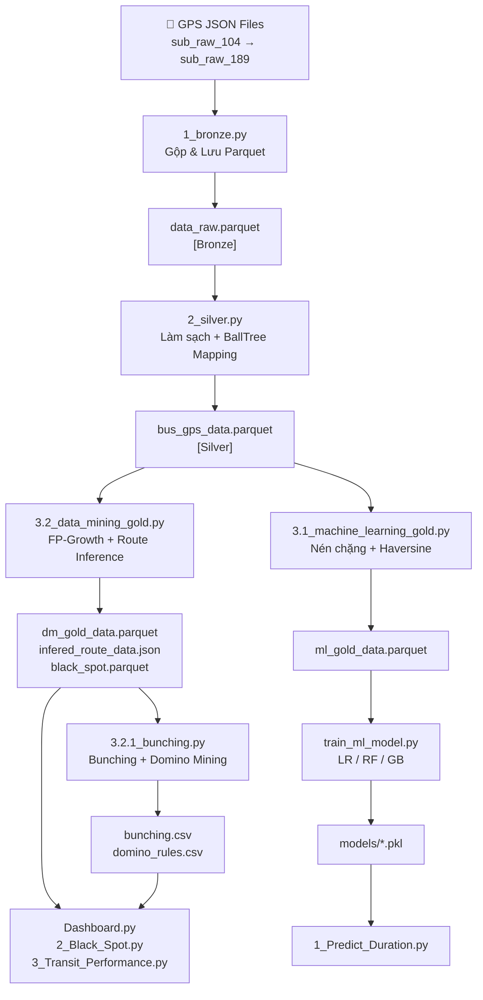

# Kiến trúc Hệ thống: Bus Status Analysis & Prediction

## Mục lục

1. [Tổng quan Kiến trúc](#1-tổng-quan-kiến-trúc)
2. [Sơ đồ Luồng Dữ liệu (Data Flow)](#2-sơ-đồ-luồng-dữ-liệu)
3. [Tầng Dữ liệu (Data Lakehouse)](#3-tầng-dữ-liệu-data-lakehouse)
4. [Các Pipeline Xử lý](#4-các-pipeline-xử-lý)
5. [Tầng Mô hình ML](#5-tầng-mô-hình-ml)
6. [Tầng Ứng dụng (Dashboard)](#6-tầng-ứng-dụng-dashboard)
7. [Cấu hình Tập trung (SSOT)](#7-cấu-hình-tập-trung-ssot)
8. [Module Tiện ích](#8-module-tiện-ích)
9. [Quy ước Đặt tên & Import](#9-quy-ước-đặt-tên--import)

---

## 1. Tổng quan Kiến trúc

Hệ thống được xây dựng theo kiến trúc **Medallion (Bronze → Silver → Gold)** — mô hình phân tầng dữ liệu phổ biến trong Data Lakehouse. Dữ liệu GPS thô của xe buýt được làm sạch, làm giàu và chuyển hóa qua ba lớp trước khi được tiêu thụ bởi lớp ứng dụng phân tích và dự báo.

```
┌─────────────────────────────────────────────────────────────────────┐
│                        NGUỒN DỮ LIỆU THÔ                           │
│              data/bus_gps/sub_raw_104.json → sub_raw_188.json       │
└────────────────────────────┬────────────────────────────────────────┘
                             │  [Pipeline 1: 1_bronze.py]
                             ▼
┌─────────────────────────────────────────────────────────────────────┐
│                        TẦNG BRONZE (1_bronze)                       │
│                       data/1_bronze/data_raw.parquet                │
│                       data/1_bronze/bus_station.json                │
└────────────────────────────┬────────────────────────────────────────┘
                             │  [Pipeline 2: 2_silver.py]
                             ▼
┌─────────────────────────────────────────────────────────────────────┐
│                        TẦNG SILVER (2_silver)                       │
│                    data/2_silver/bus_gps_data.parquet               │
│                    data/2_silver/bus_station_data.json              │
└──────────────┬──────────────────────────────┬───────────────────────┘
               │ [Pipeline 3.1]               │ [Pipeline 3.2]
               ▼                              ▼
┌──────────────────────┐          ┌───────────────────────────────────┐
│  TẦNG GOLD (ML)      │          │  TẦNG GOLD (Data Mining)          │
│  3_gold/             │          │  3_gold/dm_gold_data.parquet      │
│  ml_gold_data.parquet│          │  3_gold/infered_route_data.json   │
└──────────┬───────────┘          │  data/black_spot.parquet          │
           │                      │  data/bunching.csv                │
           │                      │  data/domino_rules.csv            │
           │  [train_ml_model.py] └──────────────┬────────────────────┘
           ▼                                     │ [Pipeline 3.2.1]
┌──────────────────┐                             │
│  models/*.pkl    │                             ▼
│  (LR, RF, GB)    │         ┌───────────────────────────────────────┐
└──────────┬───────┘         │  Bunching / Gapping Analysis          │
           │                 │  data/bunching.csv (stop_events)      │
           └─────────────────┤  data/domino_rules.csv                │
                             └──────────────┬────────────────────────┘
                                            │
                                            ▼
                        ┌───────────────────────────────────────────┐
                        │          TẦNG ỨNG DỤNG (Streamlit)        │
                        │  app/Dashboard.py (Entry Point)           │
                        │  pages/1_Predict_Duration.py              │
                        │  pages/2_Black_Spot.py                    │
                        │  pages/3_Transit_Performance.py           │
                        └───────────────────────────────────────────┘
```

---

## 2. Sơ đồ Luồng Dữ liệu



---

## 3. Tầng Dữ liệu (Data Lakehouse)

### 3.1 Bronze Layer — `data/1_bronze/`

Tầng thô nhất. Dữ liệu được tổng hợp từ 85 file JSON nguồn (`sub_raw_104.json` → `sub_raw_188.json`, `range(104, 189)` exclusive end) mà không áp dụng bất kỳ bộ lọc nghiệp vụ nào.

| File | Định dạng | Mô tả |
|------|-----------|-------|
| `data_raw.parquet` | Parquet (Snappy) | Toàn bộ điểm GPS của tất cả phương tiện theo từng giây |
| `bus_station.json` | JSON | Thông tin lộ trình và trạm xe buýt thô từ API crawl |

**Schema chính của `data_raw.parquet`:**

| Cột | Kiểu | Mô tả |
|-----|------|-------|
| `vehicle` | string | Biển số xe (Mã định danh phương tiện) |
| `datetime` | int64 | Unix timestamp (giây) |
| `x` | float64 | Kinh độ (Longitude) |
| `y` | float64 | Vĩ độ (Latitude) |
| `speed` | float64 | Tốc độ tức thời GPS (km/h) |
| `door_up` | bool | Trạng thái mở cửa xe phía trên |
| `door_down` | bool | Trạng thái mở cửa xe phía dưới |

---

### 3.2 Silver Layer — `data/2_silver/`

Dữ liệu đã được làm sạch (loại nhiễu) và làm giàu (gán trạm gần nhất bằng BallTree).

| File | Định dạng | Mô tả |
|------|-----------|-------|
| `bus_gps_data.parquet` | Parquet (Snappy) | GPS đã được làm sạch + gán trạm gần nhất |
| `bus_station_data.json` | JSON | Trạm đã được chuẩn hóa tọa độ và loại bỏ trùng lặp |

**Cột bổ sung so với Bronze:**

| Cột | Kiểu | Mô tả |
|-----|------|-------|
| `realtime` | string | Thời gian dạng `dd-MM-yyyy HH:mm:ss` (từ Unix epoch) |
| `current_station` | string | Tên trạm xe buýt gần nhất |
| `station_distance` | float64 | Khoảng cách (mét) đến trạm gần nhất |
| `is_terminal` | bool | Cờ đánh dấu trạm đầu / cuối tuyến |

**Bộ lọc áp dụng tại Silver:**

- Loại bỏ tọa độ nằm ngoài bounding box TP.HCM (`geo_bounds` trong `business_rules.yaml`)
- Loại bỏ điểm GPS cách trạm quá xa (`silver_layer_max_distance_m = 1000m`)
- Khử trùng lặp theo `(vehicle, datetime)`

---

### 3.3 Gold Layer — `data/3_gold/` + `data/`

Tầng đã sẵn sàng để phục vụ ML và Dashboard. Có hai nhánh Gold riêng biệt:

#### Nhánh Gold-ML (`3.1_machine_learning_gold.py`)

| File | Định dạng | Mô tả |
|------|-----------|-------|
| `3_gold/ml_gold_data.parquet` | Parquet | Các cặp trạm (start→end) với đặc trưng hành trình |

**Schema `ml_gold_data.parquet`:**

| Cột | Kiểu | Mô tả |
|-----|------|-------|
| `start station` | string | Trạm xuất phát |
| `end station` | string | Trạm đích |
| `hour` | int | Khung giờ (0–23) |
| `week day` | int | Ngày trong tuần (0=Thứ 2, 6=Chủ nhật) |
| `distance (m)` | float64 | Khoảng cách Haversine giữa 2 trạm (mét) |
| `duration (s)` | float64 | Thời gian di chuyển thực tế (giây) |

#### Nhánh Gold-DataMining (`3.2_data_mining_gold.py`)

| File | Định dạng | Mô tả |
|------|-----------|-------|
| `3_gold/dm_gold_data.parquet` | Parquet | GPS Silver + trip_id + inferred_route + avg_speed |
| `3_gold/infered_route_data.json` | JSON | Kết quả nhận diện tuyến của từng xe |
| `data/black_spot.parquet` | Parquet | Các điểm GPS đang kẹt xe (black spot) |
| `data/bunching.csv` | CSV | Sự kiện dừng đỗ tại trạm (stop events) với các cờ bunching/gapping |
| `data/domino_rules.csv` | CSV | Danh sách chuỗi hiệu ứng domino lây lan giữa các trạm |

---

## 4. Các Pipeline Xử lý

### 4.0 Pipeline Crawl — `pipelines/crawl_bus_station.py`

**Chức năng:** Thu thập dữ liệu trạm xe buýt từ API bên ngoài và lưu thành file JSON chuẩn.

**Output:** `data/1_bronze/bus_station.json`

---

### 4.1 Pipeline Bronze — `pipelines/1_bronze.py`

**Chức năng:** Gộp 85 file JSON thô thành một file Parquet đơn nhất.

**Luồng xử lý:**

1. Đọc tuần tự `sub_raw_104.json` đến `sub_raw_188.json` từ `data/bus_gps/` (`range(104, 189)`, exclusive end)
2. Trích xuất trường `msgBusWayPoint` từ mỗi bản ghi
3. Phân 8 bin thời gian đều nhau (hỗ trợ stratified sampling cho môi trường phát triển)
4. Gộp tất cả DataFrame và lưu sang `data/1_bronze/data_raw.parquet`

---

### 4.2 Pipeline Silver — `pipelines/2_silver.py`

**Chức năng:** Làm sạch GPS và gán trạm bằng thuật toán BallTree.

**Luồng xử lý:**

1. **Đọc:** Load `data_raw.parquet` + `bus_station.json` từ Bronze
2. **Làm sạch GPS (`clean_bus_gps_data`):**
   - Bỏ các cột không liên quan (`heading`, `aircon`, `working`, `ignition`)
   - Chuyển Unix timestamp → chuỗi `dd-MM-yyyy HH:mm:ss`
   - Khử trùng lặp theo `(vehicle, datetime)`
   - Fill NaN: `speed=0.0`, `door_up/down=False`
   - Lọc tọa độ nằm trong bounding box TP.HCM
3. **Mapping Trạm (`map_bus_to_station`):**
   - Xây BallTree trên tọa độ radian của toàn bộ trạm xe buýt
   - Query k=1 tìm trạm gần nhất cho mỗi điểm GPS
   - Gán `current_station`, `station_distance`, `is_terminal`
   - Loại điểm có `station_distance > silver_layer_max_distance_m`
4. **Lưu:** `bus_gps_data.parquet` + `bus_station_data.json` vào Silver

---

### 4.3 Pipeline Gold ML — `pipelines/3.1_machine_learning_gold.py`

**Chức năng:** Nén dữ liệu GPS thành các cặp chặng (Segment Pairs) phục vụ huấn luyện ML.

**Luồng xử lý:**

1. **Lọc tại trạm:** Chỉ giữ điểm có `station_distance ≤ station_distance_max_m (50m)`
2. **Nén điểm lặp:** Với mỗi xe, gộp các GPS ping liên tiếp cùng trạm thành 1 điểm duy nhất (chọn điểm gần tâm trạm nhất)
3. **Tạo cặp chặng:** Dùng `.shift(-1)` để ghép `current_station` → `end_station` cùng trong 1 phương tiện
4. **Tính đặc trưng:**
   - `distance (m)`: Tính bằng công thức Haversine vectorized
   - `duration (s)`: Hiệu Unix timestamp giữa 2 điểm
   - `hour`: Giờ nguyên (0–23)
   - `week day`: Thứ trong tuần (dayofweek)
5. **Lọc thực tế:**
   - Loại chặng khác ngày (chuyến qua đêm)
   - Loại chặng quá ngắn (`distance < 100m`) hoặc quá nhanh (`duration < 10s`)
6. **Lưu:** `3_gold/ml_gold_data.parquet`

---

### 4.4 Pipeline Gold Data Mining — `pipelines/3.2_data_mining_gold.py`

**Chức năng:** Nhận diện tuyến xe (Route Inference) bằng FP-Growth + Dynamic Drift Tracking.

**Luồng xử lý:**

#### Bước 1 — Tách chuyến (`split_trip_date`)

Phân chia dòng GPS liên tục thành các chuyến riêng biệt bằng ngưỡng khoảng cách thời gian (`trip_split_max_gap_sec = 4200s`). Gán `trip_id` dạng số tăng dần theo xe.

#### Bước 2 — Nhận diện Tuyến (`infer_route_dynamic_tracking`)

Triển khai thuật toán **Dynamic Drift Tracking**:

- **Memory Pool:** Duy trì tập hợp trạm đã thấy theo cửa sổ trượt
- **Phát hiện đổi tuyến (Drift Detection):** Nếu `overlap_ratio < drift_threshold (0.5)` → xe đang chạy tuyến khác → chốt segment cũ, khởi tạo segment mới
- **FP-Growth per Segment:** Tìm tập trạm thường xuyên nhất trong segment → chọn tuyến bằng Majority Voting

#### Bước 3 — Ghép Tuyến vào GPS (`merge_asof`)

Dùng `pd.merge_asof(direction='backward')` để gán `inferred_route` cho từng dòng GPS theo khoảng `[start_trip_id, end_trip_id]`.

#### Bước 4 — Tách lại chuyến theo cấu trúc Tuyến (`re_split_trips_by_route`)

Dùng chỉ mục trạm (`station_index`) từ file topology JSON để phát hiện xe quay vòng lại đầu tuyến → cắt thành chuyến mới.

#### Bước 5 — Tính tốc độ phái sinh (`calculate_derived_speed`)

Tính `avg_speed` (km/h) bằng Haversine vectorized giữa 2 ping GPS liên tiếp cùng chuyến.

#### Bước 6 — Xuất Black Spot

Lọc các điểm GPS thỏa mãn đồng thời:

- `speed < station_stationary_speed_kmh (5 km/h)`
- `avg_speed < bottleneck_max_speed_kmh (10 km/h)`
- `station_distance > jam_far_from_station_m (50m)` *(không phải đang ở trạm)*
- `is_terminal == False`
- `door_up == False AND door_down == False`

→ Lưu vào `data/black_spot.parquet`

---

### 4.5 Pipeline Bunching — `pipelines/3.2.1_bunching.py`

**Chức năng:** Phân tích Bunching/Gapping tại trạm và khai phá chuỗi hiệu ứng Domino.

#### Bước 1 — Sessioning sự kiện dừng đỗ

Lọc sự kiện tại trạm:

- `station_distance ≤ 50m`
- `speed < 5 km/h` HOẶC `door_up/down == True`
- `is_terminal == False`

Phân tách các lượt dừng: Nếu cùng xe + cùng trạm mà cách nhau > `new_session_gap_sec (600s)` → lượt dừng mới.

#### Bước 2 — Tính Dwell Time

Với mỗi `(inferred_route, current_station, vehicle, stop_session_id, trip_id)`:

- `dwell_time_mins = (departure_time - arrival_time) / 60`
- Gán cờ `is_bottleneck` nếu `dwell_time_mins >= dwell_time_anomaly_max_mins (3 phút)`

#### Bước 3 — Tính Headway

- Sort theo `(inferred_route, current_station, arrival_time)`
- `headway_mins = arrival_time - prev_arrival_time` (cùng trạm + cùng tuyến)
- Mask khoảng cách nghỉ đêm: `headway > night_break_headway_mins (180 phút)` → NaN

#### Bước 4 — Gán Cờ Trạng thái

| Điều kiện | Cờ |
|-----------|-----|
| `headway ≤ 2 phút` | `is_bunching = True`, `service_status = "Bunching"` |
| `headway ≥ 30 phút` | `is_gapping = True`, `service_status = "Gapping"` |
| `headway = NaN` | `service_status = "Unknown"` |
| Còn lại | `service_status = "Normal"` |

#### Bước 5 — Khai phá Chuỗi Domino (`mine_domino_effects`)

- Group các sự kiện lỗi liên tiếp theo `block_id` (bị cắt bởi xe đổi, chuyến đổi, hoặc trạng thái Normal)
- Lọc chuỗi có độ dài `≥ domino_min_chain_length (2)`
- Đếm tần suất từng chuỗi và lọc `≥ domino_min_occurrences (3)`
- Lưu `domino_rules.csv`

---

## 5. Tầng Mô hình ML

### 5.1 Quá trình huấn luyện — `models/train_ml_model.py`

Đọc `ml_gold_data.parquet` và huấn luyện 3 mô hình hồi quy để dự báo thời gian di chuyển giữa 2 trạm:

| Mô hình | File | Đặc điểm |
|---------|------|----------|
| Linear Regression | `linear_regression_model.pkl` | Baseline tuyến tính |
| Random Forest | `randomforest_model.pkl` | Ensemble cây quyết định |
| Gradient Boosting | `gradientboosting_model.pkl` | SOTA boosting |

**Đặc trưng đầu vào (Feature Vector):**

| Đặc trưng | Kiểu | Nguồn |
|-----------|------|-------|
| `start station` | Categorical | Trạm xuất phát (OneHotEncoder / OrdinalEncoder) |
| `end station` | Categorical | Trạm đích (OneHotEncoder / OrdinalEncoder) |
| `distance (m)` | Numeric | Haversine từ Gold-ML |
| `weekend` | Binary (0/1) | `1` nếu Thứ 7 hoặc Chủ nhật |
| `hour_sin` | Float | `sin(2π × hour / 24)` — Cyclic encoding |
| `hour_cos` | Float | `cos(2π × hour / 24)` — Cyclic encoding |
| `route_avg_duration` | Float | Trung bình lịch sử `duration(s)` của cặp tuyến |

> **Lưu ý:** Các cột `hour` và `week day` gốc bị drop trong quá trình feature engineering và thay bằng cyclic encoding (`hour_sin`, `hour_cos`) cùng binary flag (`weekend`) để mô hình nắm bắt tính tuần hoàn của thời gian.

**Biến mục tiêu:** `duration (s)` — thời gian di chuyển (giây)

---

## 6. Tầng Ứng dụng (Dashboard)

Được xây dựng bằng **Streamlit** với cấu trúc multi-page.

```
app/
├── Dashboard.py          # Entry Point — Streamlit khởi chạy từ file này
├── utils.py              # Các hàm vẽ bản đồ, thuật toán phân cụm HDBSCAN
└── pages/
    ├── 1_Predict_Duration.py   # Trang dự báo thời gian hành trình
    ├── 2_Black_Spot.py         # Bản đồ điểm kẹt xe + Domino HCMC
    └── 3_Transit_Performance.py # Heatmap Bunching/Gapping theo trạm
```

### 6.1 `app/Dashboard.py` — Entry Point & Dashboard Vận hành Chính

File này là **điểm khởi chạy duy nhất** của ứng dụng Streamlit (`streamlit run app/Dashboard.py`). Dashboard cấp C-Level hiển thị tổng quan vận hành toàn mạng lưới. Chia làm 3 tầng UI:

**Tầng 1 — KPI Cards:**

- Tổng sự kiện dừng, Tỷ lệ Bunching, Tỷ lệ Gapping, Tỷ lệ Kẹt xe, Headway trung bình, % Tài xế an toàn

**Tầng 2 — Trend Charts:**

- Biểu đồ Stacked Bar: Tần suất điểm nghẽn theo khung giờ (Bottleneck/Bunching/Gapping)
- Line Chart: Tốc độ trung bình theo giờ (lọc `avg_speed > 0`)
- Line Chart: Dwell Time trung bình theo giờ

**Tầng 3 — Deep-Dive Tabs:**

- **Tab "Bảng chi tiết các tuyến":** Xếp hạng tuyến theo tổng tỷ lệ lỗi, gradient màu Reds
- **Tab "Ma trận nhiệt tốc độ các cặp trạm":** Heatmap RdYlGn, 20 cặp trạm chậm nhất, áp dụng Proxy Filter tuyến
- **Tab "Bảng các điểm nghẽn theo trạm":** Đếm tần suất lỗi theo trạm, sắp xếp tăng dần, gradient YlOrRd
- **Tab "Bảng đánh giá các tài xế":** Phân loại hành vi tài xế bằng Hard-Rule Engine

**Bộ lọc Toàn cục:**

- Multiselect Tuyến (1 → N tuyến)
- Date Range (ngày bắt đầu → ngày kết thúc)

---

### 6.2 `pages/1_Predict_Duration.py` — Dự báo Thời gian Hành trình

Cho phép người dùng chọn cặp trạm (Start → End) và nhận dự báo thời gian từ 3 mô hình ML.

**Cơ chế chống OOD:** Load `ml_gold_data.parquet` để lấy `avg_distance` và `avg_duration` thực tế của từng cặp. Người dùng không nhập trực tiếp, tránh input nằm ngoài phân phối huấn luyện.

---

### 6.3 `pages/2_Black_Spot.py` — Bản đồ Điểm Đen Kẹt xe

Hiển thị kết quả phân cụm HDBSCAN lên bản đồ Pydeck 3D:

- **Tab Điểm đen:** HexagonLayer 3D cho mật độ kẹt xe + ScatterplotLayer cho tâm cụm
- **Tab Domino:** ArcLayer minh họa luồng lây lan, bảng PrefixSpan

**Tham số HDBSCAN điều chỉnh được qua Sidebar:** `min_cluster_size` (10–200)

---

### 6.4 `pages/3_Transit_Performance.py` — Hiệu suất Bunching/Gapping

- **Tab Heatmap:** Ma trận `(trạm × giờ)` tỷ lệ % Bunching/Gapping — chỉ hiển thị trạm có data point, giữ đúng thứ tự địa lý từ `master_station_order`
- **Tab Stacked Bar:** So sánh tỷ lệ Normal/Bunching/Gapping giữa các tuyến (100%)
- **Tab Domino:** Bar chart top chuỗi lây lan + bảng tra cứu theo tên trạm

---

## 7. Cấu hình Tập trung (SSOT)

> **Nguyên tắc cốt lõi:** Tất cả các ngưỡng nghiệp vụ (thresholds) phải được đọc từ một nguồn duy nhất: `config/business_rules.yaml`. **Không được hardcode** bất kỳ magic number nào trong code Python.

File: `config/business_rules.yaml`

```
config/
└── business_rules.yaml   # Single Source of Truth
```

Được đọc bởi `utils/config_loader.py` → trả về dict Python.

**Cách dùng trong mọi module:**

```python
from utils.config_loader import load_config
_config = load_config()

threshold = _config['bunching_threshold_mins']  # = 2.0
```

### Nhóm Ngưỡng Quan trọng

| Nhóm | Tham số | Giá trị mặc định | Mô tả |
|------|---------|-----------------|-------|
| **Không gian** | `station_distance_max_m` | 50m | Bán kính nhận dạng "tại trạm" |
| | `silver_layer_max_distance_m` | 1000m | Bán kính lọc Silver |
| | `jam_far_from_station_m` | 50m | Ngưỡng nhận diện kẹt xe giữa đường |
| **Thời gian** | `bunching_threshold_mins` | 2 phút | Ngưỡng kết luận Bunching |
| | `gapping_threshold_mins` | 30 phút | Ngưỡng kết luận Gapping |
| | `dwell_time_anomaly_max_mins` | 3 phút | Ngưỡng Bottleneck tại trạm |
| | `trip_split_max_gap_sec` | 4200 giây | Ngưỡng cắt chuyến |
| **Tốc độ** | `bottleneck_max_speed_kmh` | 10 km/h | Mức độ kẹt xe |
| | `station_stationary_speed_kmh` | 5 km/h | Tốc độ "đứng yên" |
| | `max_realistic_speed_kmh` | 100 km/h | Tốc độ GPS tối đa hợp lệ |
| **Hồ sơ Tài xế** | `driver_violation_rate_pct` | 60% | Ngưỡng Violator |
| | `driver_reckless_speed_std` | 13 | Ngưỡng Reckless (lái giật cục) |
| | `driver_high_speed_kmh` | 20 km/h | Ngưỡng Speedster |
| **Khai phá** | `ar_min_support` | 0.003 | FP-Growth min support |
| | `domino_min_occurrences` | 3 | Lọc chuỗi Domino ngẫu nhiên |

---

## 8. Module Tiện ích

### `utils/config_loader.py`

Tải `config/business_rules.yaml` và trả về dict. Hỗ trợ cache để tránh đọc file lặp lại.

### `app/utils.py`

Chứa các hàm phục vụ riêng cho tầng Ứng dụng:

| Hàm | Mô tả |
|-----|-------|
| `create_cluster(filtered_df, station_df, min_cluster_size)` | Chạy HDBSCAN, tính tâm cụm, gán nhãn trạm gần nhất |
| `sequential_mining(jam_df, min_support)` | Chạy PrefixSpan, trả về DataFrame chuỗi kẹt xe |
| `process_prefixspan_data(df_prefix)` | Parse tọa độ từ chuỗi Zone string, tạo cột source/target cho ArcLayer |
| `translate_prefixspan_patterns(df_flows, station_df)` | Dịch Zone ID → tên Trạm gần nhất (Haversine) |
| `create_pydeck_3d_heatmap(...)` | Dựng Pydeck Deck đa lớp: Trạm + HexagonLayer + Cluster |
| `create_pydeck_arc_map(...)` | Dựng Pydeck ArcLayer cho luồng Domino |

### `tests/logger.py`, `tests/exception.py`

- `get_logger(name)` — Trả về Logger console có format timestamp chuẩn `[YYYY-MM-DD HH:MM:SS] LEVEL - name: message` cho từng pipeline. Mức log mặc định `INFO`, có thể override qua biến môi trường `LOG_LEVEL`.
- `PathNotFoundError` — Exception tùy chỉnh khi file dữ liệu tiền xử lý bị thiếu

---

## 9. Quy ước Đặt tên & Import

### Quy tắc `_PROJECT_ROOT`

Mọi script trong `pipelines/` và `app/pages/` đều phải khai báo biến `_PROJECT_ROOT` để đảm bảo import tuyệt đối hoạt động bất kể thư mục làm việc hiện tại:

```python
import os, sys
_PROJECT_ROOT = os.path.abspath(os.path.join(os.path.dirname(__file__), ".."))
# Với pages/ (sâu 2 cấp):
_PROJECT_ROOT = os.path.abspath(os.path.join(os.path.dirname(__file__), "..", ".."))

if _PROJECT_ROOT not in sys.path:
    sys.path.insert(0, _PROJECT_ROOT)
```

### Quy tắc Import rõ ràng (Tránh Module Shadowing)

Vì dự án có đồng thời `utils/` (package) và `app/utils.py` (module), cần phân biệt tường minh:

```python
# ✅ Đúng — Lấy config từ package utils/
from utils.config_loader import load_config

# ✅ Đúng — Lấy hàm vẽ bản đồ từ app/utils.py
from app.utils import create_cluster, sequential_mining

# ❌ Sai — Gây Module Shadowing (Python ưu tiên utils/ và bỏ qua app/utils.py)
from utils import *
```

### Quy ước Tải file Dữ liệu

Luôn dùng `os.path.join(_PROJECT_ROOT, ...)` thay vì đường dẫn tương đối:

```python
# ✅ Đúng
gold_path = os.path.join(_PROJECT_ROOT, "data", "3_gold", "dm_gold_data.parquet")

# ❌ Sai — Phụ thuộc vào CWD khi chạy
gold_path = "./data/3_gold/dm_gold_data.parquet"
```

---

*Tài liệu này phản ánh trạng thái kiến trúc tại thời điểm 2026-04-02. Cập nhật cùng với mỗi thay đổi schema hoặc thêm pipeline mới.*
