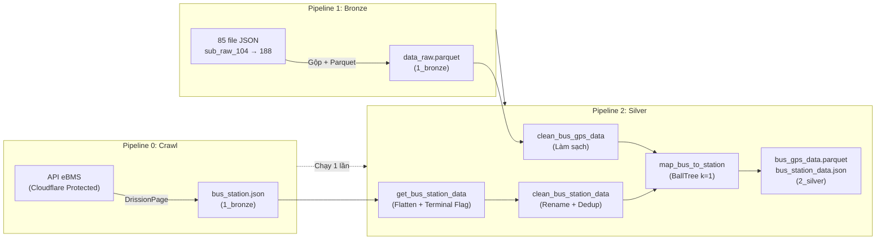
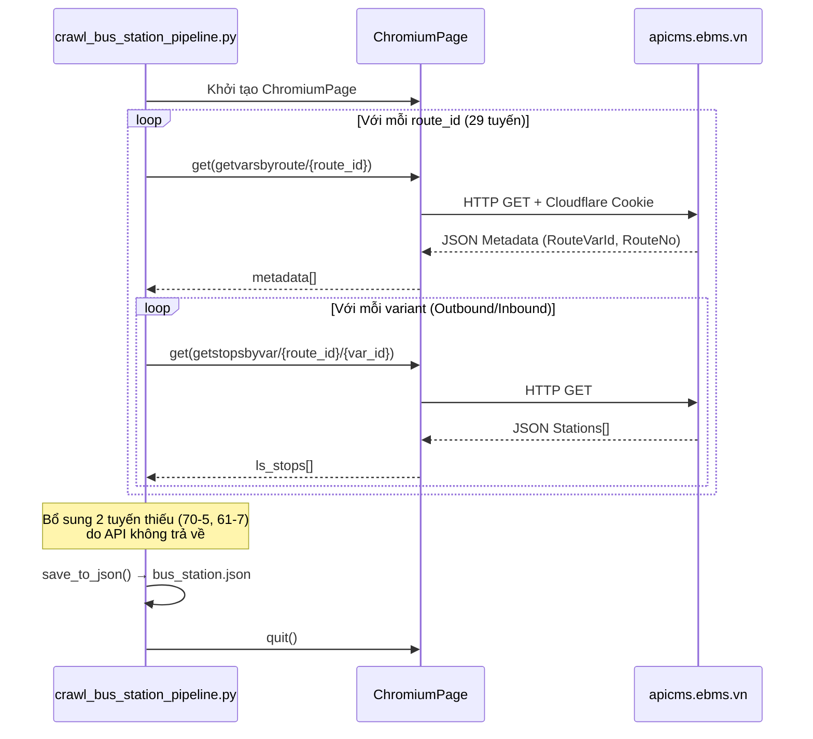
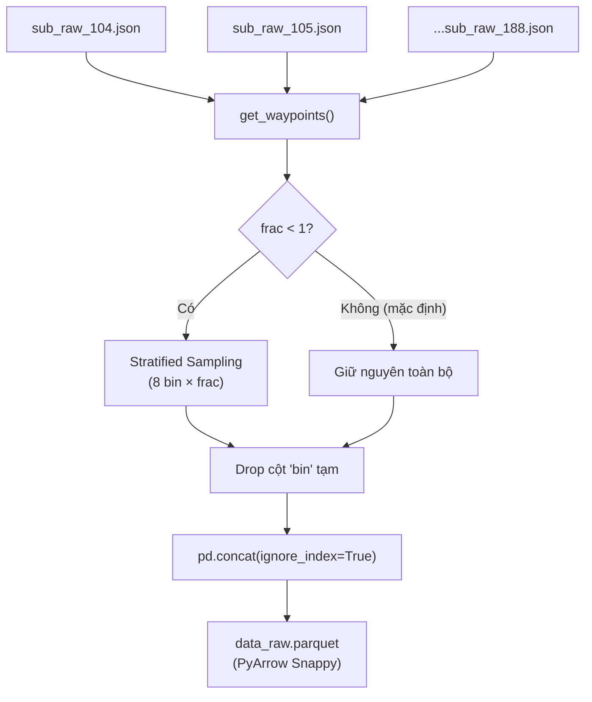
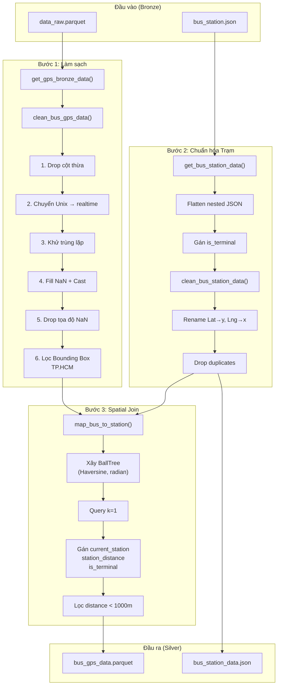

# Pipeline Chi tiết: Từ Dữ liệu Thô đến Silver Layer

> Tài liệu này mô tả chi tiết các bước xử lý dữ liệu GPS xe buýt TP.HCM, đi từ dữ liệu thô đến các tầng phân tích Gold. Bao gồm luồng: **Crawl → Bronze → Silver → Gold (ML/DM) → Bunching**.

---

## Mục lục

1. [Tổng quan Luồng xử lý](#1-tổng-quan-luồng-xử-lý)
2. [Pipeline 0: Crawl Trạm xe buýt](#2-pipeline-0-crawl-trạm-xe-buýt)
3. [Pipeline 1: Bronze Layer](#3-pipeline-1-bronze-layer)
4. [Pipeline 2: Silver Layer](#4-pipeline-2-silver-layer)
5. [Schema Đầu ra](#5-schema-đầu-ra)
6. [Ngưỡng Cấu hình Liên quan](#6-ngưỡng-cấu-hình-liên-quan)
7. [Hướng dẫn Chạy](#7-hướng-dẫn-chạy)

---

## 1. Tổng quan Luồng xử lý



**Thứ tự thực thi bắt buộc:**

| Thứ tự | Script | Tiền điều kiện | Output |
|--------|--------|---------------|--------|
| 0 | `crawl_bus_station_pipeline.py` | Trình duyệt Chromium + Internet | `data/1_bronze/bus_station.json` |
| 1 | `bronze_pipeline.py` | Thư mục `data/bus_gps/` chứa 85 file JSON | `data/1_bronze/data_raw.parquet` |
| 2 | `silver_pipeline.py` | Output của Pipeline 0 + Pipeline 1 | `data/2_silver/bus_gps_data.parquet`, `data/2_silver/bus_station_data.json` |

---

## 2. Pipeline 0: Crawl Trạm xe buýt

**File:** `pipelines/crawl_bus_station_pipeline.py`
**Tần suất chạy:** Một lần duy nhất (hoặc khi mạng lưới tuyến thay đổi)
**Dependency:** `DrissionPage` (headless Chromium automation)

### 2.1 Mục đích

Thu thập danh sách trạm dừng của tất cả tuyến xe buýt TP.HCM từ API hệ thống quản lý vận tải eBMS (`apicms.ebms.vn`). API này được bảo vệ bởi Cloudflare nên không thể gọi bằng `requests` thông thường.

### 2.2 Luồng xử lý chi tiết



#### Bước 1 — Vượt Cloudflare (`fetch_api_with_cf_bypass`)

Hàm core sử dụng cơ chế retry (tối đa 10 lần, mỗi lần cách 1 giây):

```python
# Dùng JavaScript fetch() trong ngữ cảnh trình duyệt đã bypass Cloudflare
js_code = f'''
    return fetch("{url}")
        .then(res => res.text())
        .then(text => {{
            try {{ return JSON.parse(text); }} catch (e) {{ return null; }}
        }});
'''
data = page.run_js(js_code)
```

> **Tại sao dùng `run_js(fetch())` thay vì đọc trực tiếp DOM?**
> Trình duyệt Chrome tự động format JSON thành HTML khi hiển thị, làm mất cấu trúc gốc. Gọi `fetch()` bên trong JS context trả về raw JSON nguyên bản.

#### Bước 2 — Gọi 2 API cho mỗi tuyến

| API Endpoint | Trả về | Mục đích |
|-------------|--------|----------|
| `getvarsbyroute/{route_id}` | `[{RouteVarId, RouteNo, ...}]` | Lấy metadata tuyến (mã tuyến, ID variant) |
| `getstopsbyvar/{route_id}/{var_id}` | `[{StopId, Name, Lat, Lng, Routes, ...}]` | Lấy danh sách trạm theo lượt đi/về |

**Danh sách Route ID được hardcode:**

```python
ls_route_id = [347, 349, 368, 369, 393, 394, 1, 395, 396, 77,
               350, 353, 37, 48, 32, 75, 36, 51, 20, 3,
               112, 66, 128, 53, 131, 133, 45, 70, 130]
# Tổng cộng: 29 RouteID → ~58 variants (Outbound + Inbound)
```

#### Bước 3 — Bổ sung dữ liệu thiếu

Hai tuyến `70-5` và `61-7` không có trên API nhưng xuất hiện trong GPS dataset. Script thêm thủ công tọa độ trạm đầu - cuối:

| Tuyến | Trạm đầu | Trạm cuối |
|-------|----------|-----------|
| `70-5` | Bố Heo (106.42, 11.06) | Bến xe Lộc Hưng (106.39, 11.10) |
| `61-7` | Cầu Phú Cường (106.64, 10.98) | Bến xe Bình Dương (106.67, 10.97) |

#### Bước 4 — Lưu file

Output: `data/1_bronze/bus_station.json`

**Schema mỗi phần tử:**

```json
{
    "RouteID": "50",
    "Way": "Outbound",
    "Stations": [
        {
            "StopId": "123",
            "Code": "BX95",
            "Name": "Bến xe Miền Đông",
            "Lat": 10.815,
            "Lng": 106.711,
            "Routes": "50, 55, 72",
            "is_terminal": false
        }
    ]
}
```

---

## 3. Pipeline 1: Bronze Layer

**File:** `pipelines/bronze_pipeline.py`
**Tần suất chạy:** Một lần (dữ liệu tĩnh lịch sử 7 ngày)

### 3.1 Mục đích

Gộp 85 file JSON thô chứa bản ghi GPS xe buýt thành **một file Parquet duy nhất** để tối ưu hóa tốc độ đọc cho các tầng tiếp theo.

### 3.2 Dữ liệu đầu vào

**Vị trí:** `data/bus_gps/`
**Định dạng:** JSON (mỗi file chứa mảng các bản ghi GPS)
**Số lượng:** 85 file (`sub_raw_104.json` → `sub_raw_188.json`, `range(104, 189)`)
**Quy mô ước tính:** ~1–2 triệu bản ghi GPS mỗi file

Mỗi bản ghi JSON có cấu trúc:

```json
{
    "msgBusWayPoint": {
        "vehicle": "51B-12345",
        "datetime": 1710000000,
        "x": 106.7009,
        "y": 10.7769,
        "speed": 25.5,
        "door_up": false,
        "door_down": false,
        "heading": 180,
        "aircon": true,
        "working": true,
        "ignition": true
    }
}
```

### 3.3 Luồng xử lý chi tiết



#### Bước 1 — Đọc và trích xuất (`get_waypoints`)

Với mỗi file JSON:

1. **Mở file** bằng `json.load()` với encoding UTF-8
2. **Trích xuất** trường `msgBusWayPoint` từ mỗi bản ghi → tạo danh sách dict phẳng
3. **Tạo DataFrame** từ danh sách dict
4. **Phân bin thời gian:** `pd.cut(df["datetime"], bins=8)` — chia toàn bộ khoảng Unix timestamp trong file thành 8 khoảng đều nhau

```python
data = [item["msgBusWayPoint"] for item in data]
df = pd.DataFrame(data)
df["bin"] = pd.cut(df["datetime"], bins=8)
```

#### Bước 2 — Stratified Sampling (Tùy chọn)

Khi `SCALE < 1` (ví dụ `SCALE=0.1` cho môi trường dev):

```python
if frac < 1:
    df = df.groupby("bin", observed=False).sample(frac=frac)
```

Cơ chế này đảm bảo mẫu con lấy đều từ **cả 8 khoảng thời gian**, tránh tình trạng bias vào giờ cao điểm hoặc giờ thấp điểm.

- **Production:** `SCALE = 1` → bỏ qua sampling, giữ toàn bộ dữ liệu
- **Development:** `SCALE = 0.1` → giữ ~10% dữ liệu, tiết kiệm RAM

#### Bước 3 — Gộp và Lưu

```python
df = pd.concat(dfs, ignore_index=True)
df.to_parquet("data/1_bronze/data_raw.parquet", engine="pyarrow", index=False)
```

**Tại sao dùng Parquet thay vì giữ JSON?**

| Tiêu chí | JSON (85 file) | Parquet (1 file) |
|----------|-----------------|------------------|
| Tốc độ đọc | Chậm (parse text) | Nhanh ~10x (columnar binary) |
| Dung lượng | Lớn (text + whitespace) | Nhỏ ~3-5x (Snappy compression) |
| Schema enforcement | Không | Có (kiểu dữ liệu cứng) |
| Truy vấn cột | Phải load toàn bộ | Chỉ đọc cột cần thiết |

### 3.4 Output

**File:** `data/1_bronze/data_raw.parquet`

| Cột | Kiểu | Mô tả |
|-----|------|-------|
| `vehicle` | string | Biển số xe (định danh phương tiện) |
| `datetime` | int64 | Unix timestamp (giây từ epoch) |
| `x` | float64 | Kinh độ (Longitude) |
| `y` | float64 | Vĩ độ (Latitude) |
| `speed` | float64 | Tốc độ tức thời GPS (km/h) |
| `door_up` | object | Trạng thái cửa trên (có thể NaN) |
| `door_down` | object | Trạng thái cửa dưới (có thể NaN) |
| `heading` | float64 | Hướng di chuyển (độ) — sẽ bị drop ở Silver |
| `aircon` | object | Trạng thái điều hòa — sẽ bị drop ở Silver |
| `working` | object | Trạng thái hoạt động — sẽ bị drop ở Silver |
| `ignition` | object | Trạng thái đánh lửa — sẽ bị drop ở Silver |

> **Lưu ý:** Ở tầng Bronze, dữ liệu chưa được làm sạch. Các cột `door_up`, `door_down` có thể chứa `NaN`, `0/1`, hoặc `True/False` lẫn lộn.

---

## 4. Pipeline 2: Silver Layer

**File:** `pipelines/silver_pipeline.py`
**Tần suất chạy:** Sau mỗi lần Bronze thay đổi
**Dependencies:** `scikit-learn` (BallTree), `numpy`, `pandas`, `utils.config_loader`

### 4.1 Mục đích

Biến đổi dữ liệu Bronze thô thành dataset **sạch, nhất quán, và giàu ngữ cảnh không gian** bằng cách:

1. Loại bỏ nhiễu (cột thừa, trùng lặp, tọa độ sai)
2. Chuẩn hóa kiểu dữ liệu
3. Gán trạm gần nhất cho mỗi điểm GPS bằng thuật toán BallTree

### 4.2 Tổng quan Kiến trúc



### 4.3 Bước 1: Làm sạch GPS (`clean_bus_gps_data`)

Pipeline làm sạch thực hiện **6 phép biến đổi tuần tự**, mỗi bước đều giảm kích thước dataset:

#### 4.3.1 — Drop cột không cần thiết

```python
df = df.drop(["heading", "aircon", "working", "ignition"], axis=1, errors='ignore')
```

| Cột bị xóa | Lý do |
|-------------|-------|
| `heading` | Hướng di chuyển — không dùng trong phân tích bunching/speed |
| `aircon` | Trạng thái điều hòa — không liên quan đến vận hành |
| `working` | Trạng thái hoạt động — luôn `True` nếu xe đang phát GPS |
| `ignition` | Trạng thái đánh lửa — dư thừa với `speed > 0` |

#### 4.3.2 — Chuyển đổi Thời gian (`unix_to_datetime`)

```python
df['realtime'] = pd.to_datetime(df['datetime'], unit='s').dt.strftime('%d-%m-%Y %H:%M:%S')
```

- **Đầu vào:** `datetime = 1710000000` (Unix timestamp, int64)
- **Đầu ra:** `realtime = "09-03-2024 21:20:00"` (Chuỗi ngày-tháng-năm giờ:phút:giây)
- **Giữ nguyên cột `datetime` gốc** để tính toán số học (hiệu timestamp) ở các tầng sau

> **Tại sao lưu dạng chuỗi thay vì `datetime64`?**
> Parquet của PyArrow serialize `datetime64` với timezone mặc định UTC, gây lệch giờ khi đọc lại. Lưu chuỗi `dd-MM-yyyy HH:mm:ss` đảm bảo tính nhất quán giữa các lần đọc.

#### 4.3.3 — Khử trùng lặp

```python
df = df.drop_duplicates(subset=['vehicle', 'datetime'])
df = df.sort_values(['vehicle', 'datetime'])
```

Loại bỏ các bản ghi GPS bị phát lặp (do lỗi phần cứng hoặc retry gửi dữ liệu). Khóa bất biến: `(vehicle, datetime)` — một xe không thể phát 2 tín hiệu GPS tại cùng một thời điểm.

#### 4.3.4 — Xử lý giá trị thiếu (Null Handling)

```python
# Fill NaN trước
df = df.fillna({
    'speed': 0.0,      # Thiếu tốc độ → coi như đứng yên
    'door_up': 0,       # Thiếu trạng thái cửa → coi như đóng
    'door_down': 0
})

# Ép kiểu sau
df['door_up'] = df['door_up'].astype(bool)
df['door_down'] = df['door_down'].astype(bool)
```

**Quy tắc Fill:**

| Cột | Giá trị Fill | Lý do |
|-----|-------------|-------|
| `speed` | `0.0` | Pessimistic default: xe đang đứng yên nếu không rõ tốc độ |
| `door_up` | `False` | Cửa mặc định đóng — tránh tạo sai sự kiện đón khách |
| `door_down` | `False` | Tương tự `door_up` |

> **Tại sao fill `0` trước rồi mới cast `bool`?**
> Pandas `FutureWarning`: `fillna({'door_up': False})` trực tiếp trên cột chứa mixed types (`NaN` + `int`) sẽ gây lỗi dtype mismatch. Quy trình 2 bước (`fillna(0)` → `astype(bool)`) triệt tiêu cảnh báo này.

#### 4.3.5 — Loại bỏ tọa độ thiếu

```python
df = df.dropna(subset=['y', 'x'])
```

Bản ghi thiếu tọa độ (`x` hoặc `y` là `NaN`) hoàn toàn vô dụng cho phân tích không gian → xóa triệt để.

#### 4.3.6 — Lọc theo Bounding Box TP.HCM

```python
valid_location_mask = (
    (df['y'] >= MIN_LAT) & (df['y'] <= MAX_LAT) &
    (df['x'] >= MIN_LNG) & (df['x'] <= MAX_LNG)
)
df = df[valid_location_mask].copy()
```

**Bounding Box được cấu hình trong `config/business_rules.yaml`:**

| Tham số | Giá trị | Mô tả |
|---------|---------|-------|
| `min_lat` | 10.2° | Biên dưới vĩ độ (Nam TP.HCM) |
| `max_lat` | 11.3° | Biên trên vĩ độ (Bắc — bao gồm Bình Dương, Long An) |
| `min_lng` | 106.2° | Biên trái kinh độ (Tây) |
| `max_lng` | 107.1° | Biên phải kinh độ (Đông — bao gồm Đồng Nai) |

> **Mục đích:** Loại bỏ tức thời các lỗi phần cứng GPS "văng" tọa độ ra ngoài khu vực hoạt động (ví dụ: tọa độ `(0, 0)` tại vịnh Guinea, hoặc `(90, 180)` tại Bắc Cực).

### 4.4 Bước 2: Chuẩn hóa Trạm

#### `get_bus_station_data()` — Flatten và Gán Terminal Flag

Đọc `bus_station.json` (output của Pipeline 0) và biến đổi:

```python
for route in station_dataset:
    stations = route['Stations']
    total_stations = len(stations)

    for i, station in enumerate(stations):
        station['Lat'] = float(station['Lat'])
        station['Lng'] = float(station['Lng'])
        station['is_terminal'] = (i == 0 or i == total_stations - 1)
        station_data.append(station)
```

**Biến đổi:**

| Thao tác | Mô tả |
|----------|-------|
| Flatten nested JSON | `[{RouteID, Stations: [...]}]` → danh sách phẳng tất cả trạm |
| Ép kiểu tọa độ | `Lat`, `Lng` từ string → `float` |
| Gán `is_terminal` | `True` nếu trạm ở đầu (`i == 0`) hoặc cuối (`i == total - 1`) tuyến |

> **Tại sao cần `is_terminal`?**
> Trạm đầu/cuối tuyến thường có dwell time rất cao (xe chờ khách + nghỉ giữa chuyến). Nếu không gán cờ này, thuật toán bunching sẽ báo dương tính giả `"Bottleneck"` tại mọi bến xe.

#### `clean_bus_station_data()` — Rename và Deduplicate

```python
df = df.rename(columns={'Lat': 'y', 'Lng': 'x'})
df = df.drop_duplicates()
```

Chuẩn hóa tên cột tọa độ (`Lat/Lng` → `y/x`) để khớp với convention của GPS DataFrame — điều kiện tiên quyết cho bước BallTree.

### 4.5 Bước 3: Spatial Join — Gán Trạm Gần Nhất (`map_bus_to_station`)

Đây là bước **tốn tài nguyên tính toán nhất** của toàn bộ pipeline. Với ~N triệu điểm GPS và ~M trạm, brute-force search có độ phức tạp `O(N × M)`. Thuật toán BallTree giảm xuống `O(N × log(M))`.

#### 4.5.1 — Xây dựng BallTree

```python
# Chuyển tọa độ sang radian (BallTree/Haversine yêu cầu)
station_coords = np.radians(station_df[['y','x']].values)
status_coords  = np.radians(df[['y','x']].values)

# Xây BallTree trên tập trạm (nhỏ hơn nhiều so với tập GPS)
tree = BallTree(station_coords, metric='haversine')
```

| Tham số | Giá trị | Mô tả |
|---------|---------|-------|
| `metric` | `'haversine'` | Khoảng cách trên bề mặt cầu (chính xác hơn Euclidean cho tọa độ GPS) |
| Đầu vào tree | `station_coords` (radian) | Tọa độ ~M trạm (vài trăm → vài nghìn) |
| Query points | `status_coords` (radian) | Tọa độ ~N triệu điểm GPS |

#### 4.5.2 — Query Nearest Neighbor (k=1)

```python
distances, indices = tree.query(status_coords, k=1)

flat_indices = indices.flatten()
distances_m  = distances.flatten() * 6371000  # radian → mét
```

**Công thức chuyển đổi:**
```
khoảng_cách_mét = khoảng_cách_radian × R_earth
```

Trong đó `R_earth = 6,371,000 mét` (bán kính kỹ thuật tiêu chuẩn của Trái Đất, cấu hình trong `earth_radius_m`).

#### 4.5.3 — Gán thuộc tính và Lọc

```python
# Gán bằng Numpy indexing (NHANH hơn .iloc của DataFrame)
nearest_station    = station_df['Name'].values[flat_indices]
is_terminal_flags  = station_df['is_terminal'].values[flat_indices]

df['current_station']  = nearest_station
df['station_distance'] = distances_m
df['is_terminal']      = is_terminal_flags

# Lọc Silver: Chỉ giữ điểm GPS nằm trong bán kính quy định
df = df[df['station_distance'] < _config['silver_layer_max_distance_m']].copy()
```

**Ngưỡng lọc:** `silver_layer_max_distance_m = 1000` (mét)

> **Tại sao ngưỡng Silver là 1000m thay vì 50m?**
> - **50m** (`station_distance_max_m`) = ngưỡng "tại trạm" cho nghiệp vụ Gold (bunching, boarding)
> - **1000m** (`silver_layer_max_distance_m`) = ngưỡng "gần hệ thống giao thông công cộng" cho Silver
>
> Giữ 1000m ở Silver đảm bảo không mất dữ liệu xe đang di chuyển giữa 2 trạm (khoảng cách trung bình giữa các trạm ở TP.HCM: 300–800m). Nếu lọc 50m ngay ở Silver, toàn bộ dữ liệu di chuyển giữa các trạm sẽ bị xóa.

#### 4.5.4 — Tại sao dùng Numpy Array thay vì Pandas iloc?

```python
# ❌ Chậm — iloc phải check bounds + tạo Series trung gian
nearest_station = station_df.iloc[flat_indices]['Name']

# ✅ Nhanh — truy cập trực tiếp bộ nhớ Numpy
nearest_station = station_df['Name'].values[flat_indices]
```

Với ~1 triệu điểm GPS, phương pháp Numpy nhanh hơn **5-10x** so với Pandas iloc.

### 4.6 Lưu Output

```python
output_dir = os.path.join(_PROJECT_ROOT, "data", "2_silver")
os.makedirs(output_dir, exist_ok=True)

silver_df.to_parquet(gps_out_path, engine="pyarrow", index=False)
station_df.to_json(station_out_path, orient="records", force_ascii=False, indent=4)
```

| File | Định dạng | Mô tả |
|------|-----------|-------|
| `bus_gps_data.parquet` | Parquet (Snappy) | GPS đã làm sạch + gán trạm gần nhất |
| `bus_station_data.json` | JSON (records) | Trạm đã chuẩn hóa tọa độ + `is_terminal` |

---

## 5. Schema Đầu ra

### 5.1 `data/2_silver/bus_gps_data.parquet`

| Cột | Kiểu | Nguồn | Mô tả |
|-----|------|-------|-------|
| `vehicle` | string | Bronze | Biển số xe |
| `datetime` | int64 | Bronze | Unix timestamp gốc (giây) |
| `x` | float64 | Bronze | Kinh độ (Longitude) |
| `y` | float64 | Bronze | Vĩ độ (Latitude) |
| `speed` | float64 | Bronze | Tốc độ tức thời GPS (km/h), `NaN` → `0.0` |
| `door_up` | bool | Bronze + Fill | Trạng thái cửa trên, `NaN` → `False` |
| `door_down` | bool | Bronze + Fill | Trạng thái cửa dưới, `NaN` → `False` |
| `realtime` | string | **Derived** | Thời gian `dd-MM-yyyy HH:mm:ss` |
| `current_station` | string | **BallTree** | Tên trạm gần nhất |
| `station_distance` | float64 | **BallTree** | Khoảng cách đến trạm gần nhất (mét) |
| `is_terminal` | bool | **BallTree** | Trạm đầu/cuối tuyến |

### 5.2 `data/2_silver/bus_station_data.json`

| Cột | Kiểu | Mô tả |
|-----|------|-------|
| `StopId` | string | Mã trạm từ API eBMS |
| `Code` | string | Mã viết tắt trạm |
| `Name` | string | Tên đầy đủ trạm |
| `StopType` | string | Loại trạm (Bến xe / Trạm dừng) |
| `y` | float64 | Vĩ độ (đã rename từ `Lat`) |
| `x` | float64 | Kinh độ (đã rename từ `Lng`) |
| `Routes` | string | Danh sách tuyến đi qua trạm (comma-separated) |
| `is_terminal` | bool | Trạm đầu/cuối tuyến |

---

## 6. Ngưỡng Cấu hình Liên quan

Tất cả ngưỡng dưới đây được đọc từ `config/business_rules.yaml` (Single Source of Truth):

| Tham số | Giá trị | Pipeline | Mục đích |
|---------|---------|----------|----------|
| `geo_bounds.min_lat` | 10.2 | Silver | Biên dưới bounding box |
| `geo_bounds.max_lat` | 11.3 | Silver | Biên trên bounding box |
| `geo_bounds.min_lng` | 106.2 | Silver | Biên trái bounding box |
| `geo_bounds.max_lng` | 107.1 | Silver | Biên phải bounding box |
| `silver_layer_max_distance_m` | 1000 | Silver | Bán kính giữ lại điểm GPS (mét) |
| `earth_radius_m` | 6371000.0 | Silver | Hằng số chuyển radian → mét |

---

## 7. Hướng dẫn Chạy

### 7.1 Tiền điều kiện

```bash
# Cài đặt dependencies
pip install -r requirements.txt

# Đảm bảo có dữ liệu nguồn
ls data/bus_gps/sub_raw_*.json   # 85 file JSON
```

### 7.2 Chạy tuần tự

```bash
# Bước 0: Crawl trạm (chỉ cần chạy 1 lần)
python -m pipelines.crawl_bus_station_pipeline

# Bước 1: Tạo Bronze
python -m pipelines.bronze_pipeline

# Bước 2: Tạo Silver
python -m pipelines.silver_pipeline
```

### 7.3 Log mẫu khi chạy thành công

```
[2026-04-02 17:53:58] INFO - bronze_pipeline: Đang đọc dữ liệu
100%|██████████████████████████████████████| 85/85 [02:30<00:00]
[2026-04-02 17:56:28] INFO - bronze_pipeline: Đang lưu dữ liệu
[2026-04-02 17:56:35] INFO - bronze_pipeline: Số dòng dữ liệu: 12345678

[2026-04-02 17:56:40] INFO - silver_pipeline: Đang đọc dữ liệu từ bronze...
[2026-04-02 17:56:50] INFO - silver_pipeline: Số dòng ban đầu (Bronze): 12345678
[2026-04-02 17:57:10] INFO - silver_pipeline: Số dòng sau khi làm sạch: 11234567
[2026-04-02 17:58:30] INFO - silver_pipeline: Số dòng sau khi Mapping (Silver Layer): 9876543
[2026-04-02 17:58:45] INFO - silver_pipeline: Đã lưu file Silver thành công!
```

### 7.4 Xử lý lỗi thường gặp

| Lỗi | Nguyên nhân | Cách khắc phục |
|-----|-------------|----------------|
| `PathNotFoundError: data/1_bronze/bus_station.json` | Chưa chạy Pipeline 0 | Chạy `crawl_bus_station_pipeline.py` trước |
| `PathNotFoundError: data/1_bronze/data_raw.parquet` | Chưa chạy Pipeline 1 | Chạy `bronze_pipeline.py` trước |
| `MemoryError` khi chạy Bronze | RAM < 8GB + full scale | Giảm `SCALE` xuống `0.5` hoặc `0.1` |
| `ConfigLoadError: business_rules.yaml` | Thiếu file config | Kiểm tra `config/business_rules.yaml` tồn tại |

---

*Tài liệu cập nhật lần cuối: 2026-04-02. Tham chiếu chéo: [architecture.md](architecture.md).*
